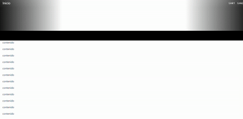

<h1>Barra de navegación</h1>

Esta barra de navegación es invisible mientras esta en la portada y se hace visible cuando sale de ella. De esta forma se obtiene un efecto muy interesnate de arrastre de barra.

Para este efecto usamos CSS y JavaScript

